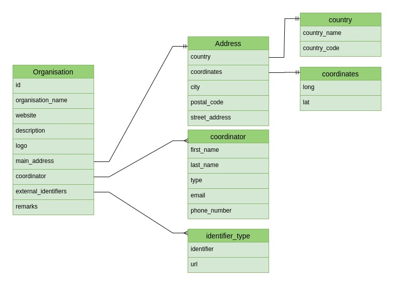

# Demo Organisation Translator

## Description
Demo application build to translate organisation data and insert them into Cordra. 
The commandline runner application uses a csv file as basis for the input.
It gathers data from ROR and Gbif and creates/updates an Organisation Digital Object.
The application consists of several separate steps:
- Reads csv file to Java Objects (CsvOrganisation).
The application reads a couple of fields from the csv file which are needed for further data gathering.
- Mapping of the csv file to Digital Object Organisation (minimally populated DO's)
- Retrieves additional information from ROR endpoint (Website, Cite, Lat/Lon, Country and WikiData) and adds this to the Digital Object
- Retrieves additional information from Gbif endpoint (Description, Logo, Contacts, Postal code and Streetname)
- Create or update the information in Cordra
It checks if the digital object is already present in Cordra, current check uses `organisation_name`,`country_name` and `gbif_id`.
If the object is not yet present it creates the object based on the Java DOOrganisation object.
If the object is already present it checks if the update in Cordra is equal to the object newly build.
If the object is the same no actions is needed.
If the object differ than new information has been added to the organisation and the digital object in Cordra need to be updated.

Errors are logged as ERROR (client error or errors found within the ROR endpoint).

Warnings are used when expected information is missing but the object can still be build (for example missing `last_name` in Gbif endpoint).

## Datamodel
For the organisation the following datamodel has been used:

See for json schema -> `.\organisation-schema.json` or https://nsidr.org/#objects/20.5000.1025/6e99c1d3b1502c090dcd
## Parameter explanation
Parameters should be supplied as environmental arguments.
Application is expected to run as a docker container or kubernetes job.
Running als commandline application will require code changes.

### Cordra parameters
- `cordra.username` This parameter needs to be the username of a user with sufficient authorization to create objects
- `cordra.password` Password of the user
- `cordra.service-id` The service id of the handle service
- `cordra.ip-address` The ip address of the cordra instance
- `cordra.port` The port of the DOIP port of the cordra instance

### Application properties
- `application.delete-all` Option to delete all Organisations in Cordra (default is `false`)
- `application.filename` Filename of the csv file with the organisations (default is `organisations.csv` located in the resources folder)

## Installation instructions
### IDE
Pull the code from Github and open in your IDE.
Fill in the `application.properties` with the parameters described above.
Run the application.

### Docker
Ensure that parameters are either available as environmental variables are added in the `application.properties`.
Build the Dockerfile with `docker build . -t demo-organisations-translator`
Run the container with `docker run demo-organisations-translator`

## Known issues/potential improvements
### Equals with objects in database
It is difficult to checks when an organisation is already in cordra or when it is new.
There are no fields in the organisation in which differences can be easily checked.
Currently we check on: 
- organisation_name
- country_name
- gbif_id
But there is still one organisation which cannot be distinguished as all these fields are equal (`Comenius University`).

### Parsing between JSON and Json
Two different libraries for json serializing/deserializing are used, Jackson and GSON.
GSON is used in DOIP library, and it might be good to transition completely to GSON.
